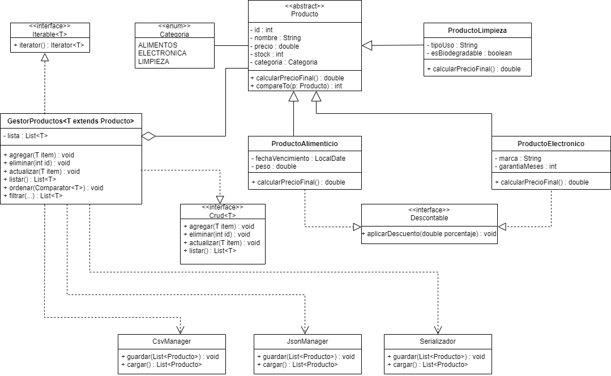

# Sistema de Gestión de Inventario (Java)

## 📌 Descripción

Aplicación desarrollada en Java como proyecto final de Programación II.
Permite gestionar un conjunto de productos utilizando principios de programación orientada a objetos, estructuras de datos y persistencia de información.

---

## 📊 Diagrama UML

## 🎯 Objetivo

Implementar un sistema flexible y extensible que permita administrar distintos tipos de productos, aplicando conceptos como:

* Herencia
* Polimorfismo
* Interfaces
* Genéricos
* Manejo de colecciones

---

## ⚙️ Funcionalidades principales

* Alta, baja y modificación de productos (CRUD)
* Listado completo de productos
* Ordenamiento y filtrado
* Manejo de diferentes tipos de productos:

  * Alimenticios
  * Electrónicos
  * Limpieza
* Aplicación de descuentos (según tipo)
* Persistencia de datos en:

  * CSV
  * JSON
  * Serialización

---

## 🧱 Estructura del proyecto

* `model` → clases principales (Producto y derivados)
* `service` → lógica del negocio (GestorProductos)
* `persistence` → manejo de archivos
* `util` → utilidades
* `exception` → manejo de errores
* `ui` → interacción con el usuario

---

## 🧩 Tecnologías utilizadas

* Java
* NetBeans
* Colecciones (List, Iterator)
* Manejo de archivos

---

## 📊 Diseño

El sistema fue modelado utilizando UML, aplicando:

* Clases abstractas
* Interfaces (`Crud`, `Descontable`, `Iterable`)
* Relaciones de herencia y agregación

---

## 🚀 Estado del proyecto

En desarrollo — implementación progresiva de funcionalidades.

---

## 👤 Autor

Luca Famozo
